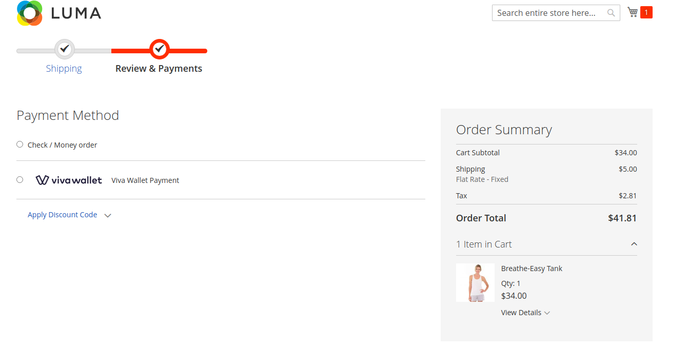
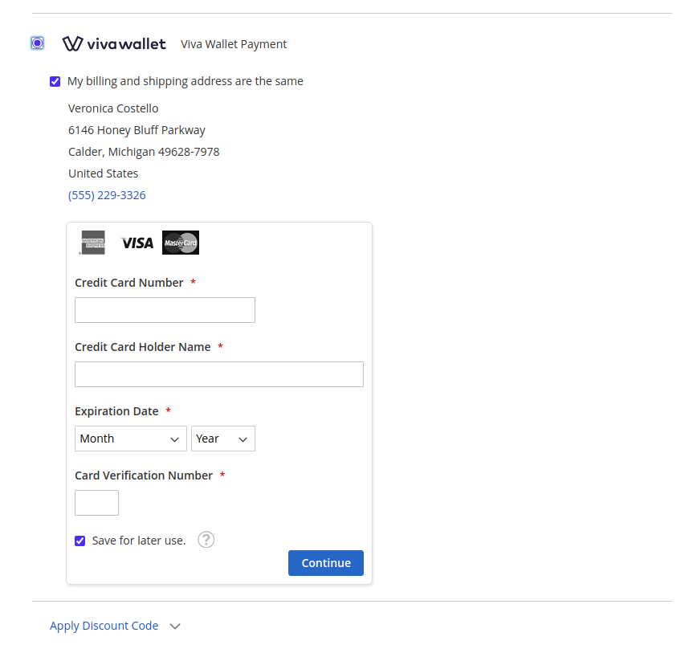
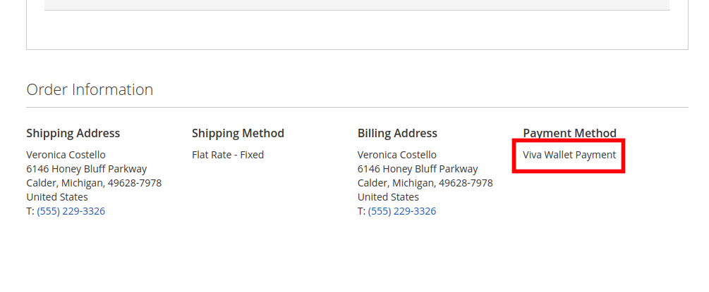
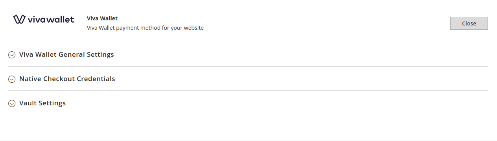
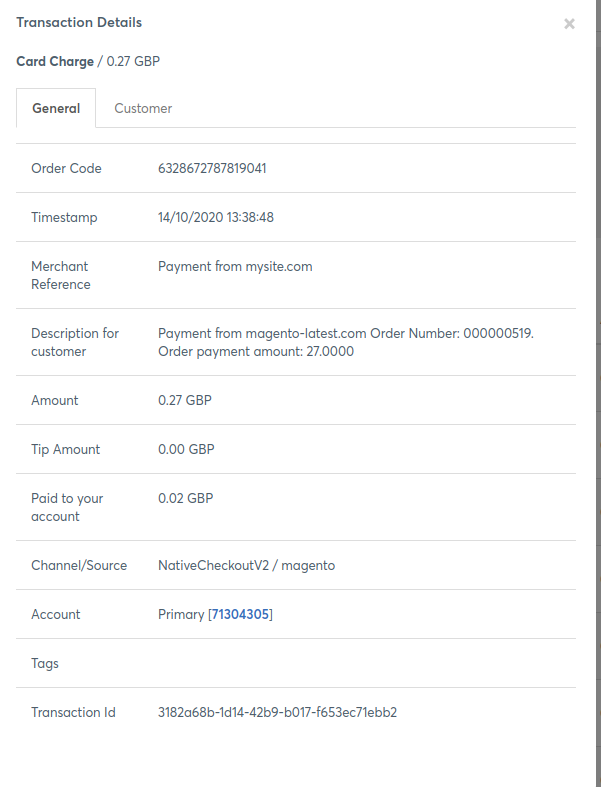
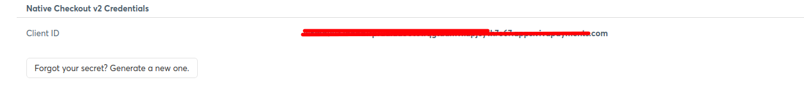

# Magento 2 VivaWallet Payment Module Free
Integration with VivaWallet.

Official web site: https://www.vivawallet.com/

Developer portal: https://developer.vivawallet.com/

Sandbox: https://demo.vivapayments.com/en/signin

Tested Credit Card: https://developer.vivawallet.com/integration-reference/test-cards-and-environments/


Tested on Magento 2.4.0/2.4.2


## Features
- Based on Magento payment gateway
- Vault functionality (save credit card for payments in future)
- Enable/disable payment from admin panel

During rendering available payment methods on checkout page, module will check VivaWallet account credentials and if they are not right, payment method won't be displayed (like Braintree payment functionality).

Module uses native checkout https://developer.vivawallet.com/online-checkouts/native-checkout-v2/

<b>WARNING:</b> this module may have bugs! Test before using on production. If you find any bug, please, create issue. 

<b>WARNING:</b> If your users were not redirected to VivaWallet payment confirm page, please, edit your etc/csp_whitelist.xml









## Configuration

In order to enable module, please, follow:

```
Stores -> Configuration -> Sales -> Payment Methods -> VivaWallet
```




### General Settings Tab

<b>Enabled</b> - enable or disable module

<b>Title</b> - title will be displayed on the payment select page

<b>Credit Card Types</b> - allowed credit card types

<b>Accepted Currency</b> - allowed currency for payment

<b>Currency ISO 4217 Number</b> - 	
It should be set to the same ISO 4217 currency number as your Viva Wallet account. F.e GB has 826 currency code, EUR has 978, USD has 840. [More info here](https://en.wikipedia.org/wiki/ISO_4217)

<b>Payment from Applicable Countries</b> and <b>Payment from Specific Countries</b> - manage allowed countries

<b>Minimum Order Total</b> - minimum order total for payment

<b>Enable Debug Mode</b> - in debug mode all payments will go through sandbox

<b>Test Payment Url</b> - sandbox url

<b>Production Payment Url</b> - real payment account url

<b>Merchant transaction reference</b> you will see this text in your VivaWallet account in transaction





### Native Checkout Credentials Tab

<b>Client ID</b> - for example "XXXXXXXXXXXXXXXXXdlauo0t6wqgtdamvxapjeyXXXXXX.apps.vivapayments.com" . Must be taken from your VivaWallet Account (Settings -> Api Access -> "Native Checkout v2 Credentials" - Client ID )



<b>Secret Key</b> - for example 1XXXXXXXKh5hqxQNSZ63C0NO853XtQ .  Must be taken from your VivaWallet Account like client id

<b>Production Payment Source Code</b> - See about source code here: https://developer.vivawallet.com/getting-started/create-a-payment-source/


### Vault Setting Tab (save credit cart for payments in future )

<b>Enabled</b> - enable or disable vault

<b>Vault Title</b> - visible for users in storefront
